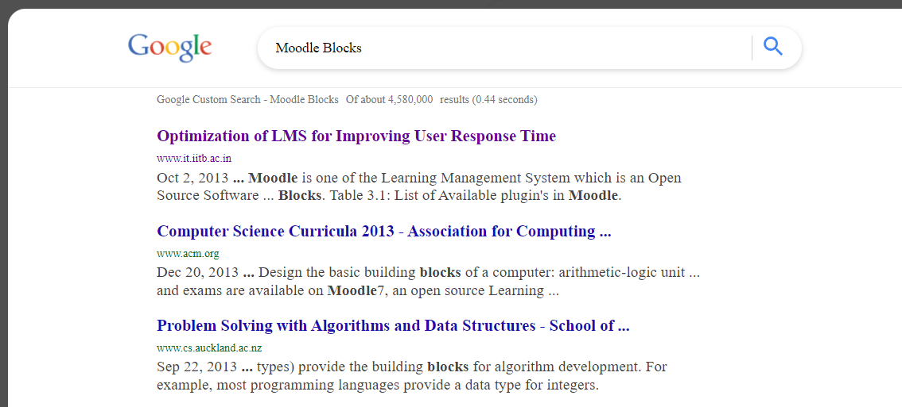

# Custom Search JSON API

## [Demo](http://example.net "Custom Search JSON API") Custom Search JSON API



### **Tamplate Url:**

### https://www.googleapis.com/customsearch/v1

- *q={searchTerms}*
- *&num={count?}*
- *&start={startIndex?}*
- *&safe={safe?}*
- *&cx={cx?}*
- *&sort={sort?}*
- *&filter={filter?}*
- *&gl={gl?}*
- *&cr={cr?}*
- *&googlehost={googleHost?}*
- *&c2coff={disableCnTwTranslation?}*
- *&hq={hq?}*
- *&hl={hl?}*
- *&siteSearch={siteSearch?}*
- *&siteSearchFilter={siteSearchFilter?}*
- *&exactTerms={exactTerms?}*
- *&excludeTerms={excludeTerms?}*
- *&linkSite={linkSite?}*
- *&orTerms={orTerms?}*
- *&relatedSite={relatedSite?}*
- *&dateRestrict={dateRestrict?}*
- *&lowRange={lowRange?}*
- *&highRange={highRange?}*
- *&searchType={searchType}*
- *&fileType={fileType?}*
- *&rights={rights?}*
- *&imgSize={imgSize?}*
- *&imgType={imgType?}*
- *&imgColorType={imgColorType?}*
- *&imgDominantColor={imgDominantColor?}*
- *&alt=json*
- *&lr=lang_de*
- *&lr={language?}*
- *&searchType=image*
- *&fileType=jpg*
- *&imgSize=medium*
- *&alt=json*
- *&sort=date*


## JSON response

``` json
{
 "kind": "customsearch#search",
 "url": {
  "type": "application/json",
  "template": "https://www.googleapis.com/customsearch/v1?q={searchTerms}&num={count?}&start={startIndex?}&lr={language?}&safe={safe?}&cx={cx?}&cref={cref?}&sort={sort?}&filter={filter?}&gl={gl?}&cr={cr?}&googlehost={googleHost?}&c2coff={disableCnTwTranslation?}&hq={hq?}&hl={hl?}&siteSearch={siteSearch?}&siteSearchFilter={siteSearchFilter?}&exactTerms={exactTerms?}&excludeTerms={excludeTerms?}&linkSite={linkSite?}&orTerms={orTerms?}&relatedSite={relatedSite?}&dateRestrict={dateRestrict?}&lowRange={lowRange?}&highRange={highRange?}&searchType={searchType}&fileType={fileType?}&rights={rights?}&imgSize={imgSize?}&imgType={imgType?}&imgColorType={imgColorType?}&imgDominantColor={imgDominantColor?}&alt=json"
 },
 "queries": {
  "nextPage": [
   {
    "title": "Google Custom Search - Testing",
    "totalResults": "2900",
    "searchTerms": "Testing",
    "count": 10,
    "startIndex": 11,
    "inputEncoding": "utf8",
    "outputEncoding": "utf8",
    "safe": "off",
    "cx": "MY_SEARCH_ENGINE_ID"
   }
  ],
  "request": [
   {
    "title": "Google Custom Search - Testing",
    "totalResults": "2900",
    "searchTerms": "Testing",
    "count": 10,
    "startIndex": 1,
    "inputEncoding": "utf8",
    "outputEncoding": "utf8",
    "safe": "off",
    "cx": "MY_SEARCH_ENGINE_ID"
   }
  ]
 },
 "context": {
  "title": "Test Search Engine"
 },
 "searchInformation": {
  "searchTime": 0.299265,
  "formattedSearchTime": "0.30",
  "totalResults": "2900",
  "formattedTotalResults": "2,900"
 },
 "items": [
  // ... Search Result here
 ]
}
